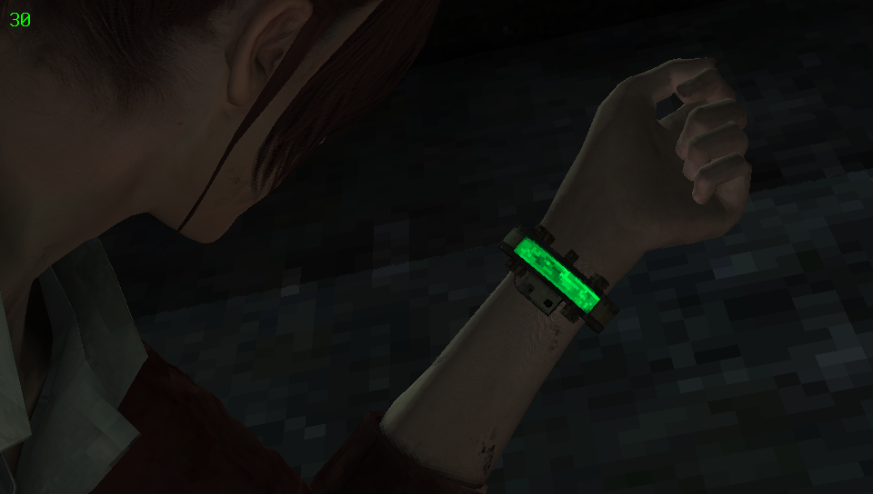

# Vita Nearest Neighbour
Simple taiHEN plugin for PlayStation Vita that overrides texture sampling. Forces to draw textures with point filtering method (with Nearest-neighbour interpolation), instead of default linear (Bilinear filtering).

## 📷 Showcase
Screenshots with:
- Sharp pixelization - redefined Nearest-neighbour sampling
- Blurry textures - original Bilinear sampling
### Duke Nukem 3D: Megaton Edition

SceGxm · 960x544
### Resident Evil: Revelations 2

SceGxm · 960x544 · VitaGrafix
### Super Mario 64

VitaGL · 960x544
### Max Payne

VitaGL · 960x544
### Call of Duty: Black Ops: Declassified

SceGxm · 720x408

## 🤚 Usage
You can simply install plugin via **[AutoPlugin II](https://github.com/ONElua/AutoPlugin2)** or do it manually:
1. Download and put **[VitaNearestNeighbour.suprx](https://github.com/MuxaJlbl4/Vita-Nearest-Neighbour/releases)** into your **tai** folder  
2. Append `*ALL` section in `ux/ur0:tai/config.txt` with:
	```
	*ALL
	ux0:tai/VitaNearestNeighbour.suprx
	```
	Or create `*TITLE_ID` section to choose only specific game. For example **Disgaea 3: Absence of Detention (Eu region)**:
	```
	*PCSB00098
	ux0:tai/VitaNearestNeighbour.suprx
	```
	See **[taihen-parser repo](https://github.com/DaveeFTW/taihen-parser)** for more info  
3. **Reload taiHEN config.txt** from Settings app or reboot your Vita  

## 📜 Notes
- Plugin only affects on magnified textures. Minified textures are untouched
- Some **VitaGL** homebrews [requires small patch](https://github.com/Rinnegatamante/vitaGL/issues/77#issuecomment-907796222) for compatibility
- For opposite effect, use [Vita-Bilinear](https://github.com/swosho/Vita-Bilinear)

## 🧱 Building
- Requires **[Vita SDK](https://vitasdk.org)**  
- Compile with:
	```
	cmake CMakeLists.txt  
	make
	```